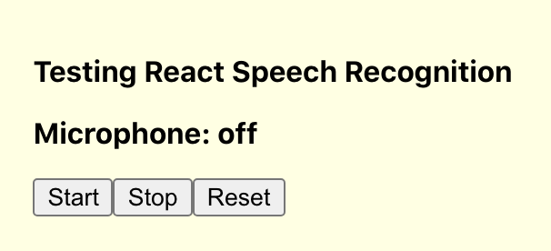

# :microphone: Testing React Speech Recognition :microphone:

I wanted to find a library for that purpose; which I found so made a small repo with `create-react-app` to try it.
It works! It's awesome.

## How to run it:

```
git clone git@github.com/GBouffard/testing-react-speech-recognition
cd testing-react-speech-recognition
npm install
npm start
```

## Desktop preview:


